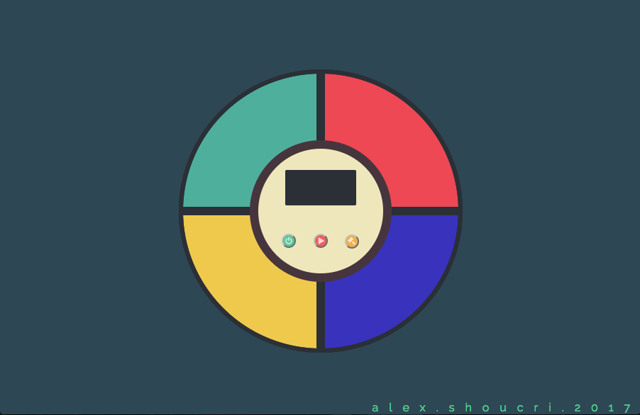

# Simon Game
The purpose of this project is to replicate the functionalities found in a real-life Simon Game and implement it as a web application game.
This game is developed using HTML, custom CSS, Javascript (with the use of jQuery).

The project is available at [alexshoucri.com/simongame](http://alexshoucri.com/simongame)

## Objectives
The objective of the game is to successfully repeat a random pattern showed on the screen. The game starts with a random pattern equal to 1 step. Each time the user successfully inputs the pattern showed, the same series is repeated with an additional step. The user wins the game by correctly entering the series of 20 steps previously showed. The user is notified of his victory and invited to start a new game.

### Challenges
The main challenge encountered while developing this game was to make sure that the order of execution of each step in a pattern was respected (time wise) while the overall execution of the program remained asynchronous.

## Features
Several functionalities are found throughout the game.

1. **Power button**

The game is turned on and the counter is set to 0. The user can either press on the **Play** button or **Strict mode** button in order to start a game.

2. **Standard mode**

When the user presses the **Play** button, she/he is presented with the first count of a random pattern.

3. **Strict mode**

This is similar to the **Standard mode**. However, by playing in **Strict mode**, if the user incorrectly inputs the pattern previously showed, it notifies the user and the game restarts at 1 with a new random series of button presses.

3. **Step counter**

At all times, the user can follow his progression and see how many steps are in the current series of patterns.

4. **Audio and color highlight**

Each color on the pad is associated to a specific audio sound. When the computer or user plays a color, it will highlight that specific color while simultaneously play the corresponding sound.

5. **Incorrect input** (Standard mode only)

If the user presses the wrong button, she/he is notified and that series of button presses starts again. Afterwards, the user can once again try to enter the correct pattern.

6. **Restart game**

If the user wants to restart a game before winning the game, the user can press the **Play** button to do so. The game will return to a single step.

## Acknowledgment
The design and layout was inspired by [Ralph Cifra's](https://cdn.dribbble.com/users/380540/screenshots/1778330/simon.jpg) art work available on [Dribbble](https://dribbble.com/).
